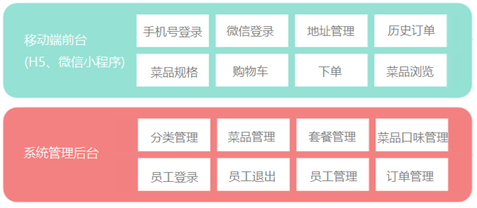

# 仿外卖平台

## 1、技术架构

## 2、功能架构

## 3、项目角色

| 角色             | 权限操作                                                     |
| ---------------- | ------------------------------------------------------------ |
| 后台系统管理员   | 登录后台管理系统，拥有后台系统中的所有操作权限               |
| 后台系统普通员工 | 登录后台管理系统，对菜品、套餐、订单等进行管理 (不包含员工管理) |
| 客户端端用户          | 登录移动端应用，可以浏览菜品、添加购物车、设置地址、在线下单等 |

## 4、数据库表结构

| 表名     | 说明             |
| -------- | ---------------- |
| sys_user | 客户端用户信息表 |

